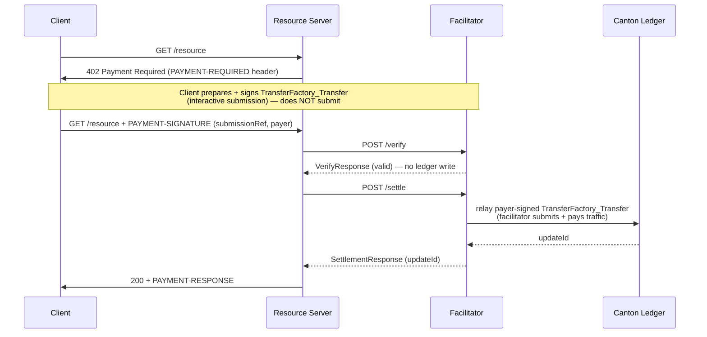

# Exact Payment Scheme for Canton Network (`exact`)

This document specifies the `exact` payment scheme for the x402 protocol on
Canton Network. The client signs a `TransferFactory_Transfer` (CIP-56 Token
Standard transfer instruction) naming the merchant as receiver, but does **not**
submit it. The facilitator relays the payer-signed transaction and pays the
network traffic fee. Because the merchant holds a standing `TransferPreapproval`,
the transfer resolves directly — moving Canton Coin to the merchant in a single
facilitator-submitted transaction. No escrow, no lock step, no facilitator
custody.

## Scheme Name

`exact`

## Networks

| Network | Identifier |
|---|---|
| Canton MainNet | `canton:mainnet` |
| Canton TestNet | `canton:testnet` |
| Canton DevNet | `canton:devnet` |

## Protocol Flow

One transaction settles each payment:

- **Client (off-ledger):** signs a `TransferFactory_Transfer` — `sender = payer`,
  `receiver = merchant`, `amount`, the specific `inputHoldingCids` spent, and an
  `executeBefore` deadline — as an interactive submission. The client does not
  submit it to the ledger; it hands the signed submission to the facilitator in
  the payment payload.
- **Facilitator (on-ledger):** relays (submits) the payer-signed transaction and
  pays the traffic fee. Because the merchant holds a live `TransferPreapproval`,
  the transfer resolves `direct` and pays the merchant in one transaction. The
  facilitator signs nothing on the payer's behalf.



## Merchant Onboarding

Before receiving payments, the merchant MUST hold a live `TransferPreapproval`
for the Canton Coin instrument, with the merchant as receiver. The preapproval is
what lets an incoming `TransferFactory_Transfer` resolve **direct** — accepted
automatically and settled in a single transaction. Without it, the transfer
resolves to a two-step `TransferInstruction` that the merchant must accept in a
second transaction, so the facilitator cannot settle in one round-trip and MUST
reject the payment (see Verification Rule 7).

A `TransferPreapproval` is time-bounded. The merchant creates it once through its
own wallet/validator (receiver = the merchant) and reuses it for all payers, and
MUST renew it before expiry to keep the one-transaction path available.

## `PaymentRequirements` for `exact`

```json
{
  "scheme": "exact",
  "network": "canton:mainnet",
  "amount": "1000000000",
  "asset": "CC",
  "payTo": "merchant_party::1220abc...",
  "maxTimeoutSeconds": 60,
  "extra": {
    "assetTransferMethod": "transfer-factory",
    "feePayer": "ftp_facilitator::1220def...",
    "synchronizerId": "global-domain::1220xyz...",
    "instrumentId": { "admin": "DSO::1220...", "id": "Amulet" },
    "executeBeforeSeconds": 120,
    "memo": "invoice-2024-001"
  }
}
```

- `amount`: Integer string of atomic units (1 CC = 1e10 units).
  `"1000000000"` = 0.1 CC. Must match exactly what the ledger records.
- `asset`: `"CC"`. Settles Canton Coin only.
- `payTo`: Merchant's Canton party id `"<name>::<fingerprint>"`.
- `extra.assetTransferMethod`: MUST be `"transfer-factory"`.
- `extra.feePayer`: The facilitator's Canton party id — the party that relays the
  payer-signed transfer and pays its traffic fee. Clients MUST NOT alter this
  value.
- `extra.synchronizerId`: The Global Synchronizer the transfer settles on.
- `extra.instrumentId`: The Canton Coin instrument identifier
  `{ "admin": "<DSO-party>", "id": "Amulet" }`.
- `extra.executeBeforeSeconds`: Relative deadline (seconds from request time) the
  client uses to compute the absolute `executeBefore` timestamp in the transfer;
  after it, the signed transfer is no longer executable.
- `extra.memo` (optional): Seller-defined UTF-8 string, max 256 bytes. When
  present, the client MUST include it in the transfer's metadata.

## `PaymentPayload` `payload` Field

```json
{
  "x402Version": 2,
  "resource": {
    "url": "https://api.example.com/data",
    "description": "Access to protected resource",
    "mimeType": "application/json"
  },
  "accepted": {
    "scheme": "exact",
    "network": "canton:mainnet",
    "amount": "1000000000",
    "asset": "CC",
    "payTo": "merchant_party::1220abc...",
    "maxTimeoutSeconds": 60,
    "extra": {
      "assetTransferMethod": "transfer-factory",
      "feePayer": "ftp_facilitator::1220def...",
      "synchronizerId": "global-domain::1220xyz...",
      "memo": "invoice-2024-001"
    }
  },
  "payload": {
    "assetTransferMethod": "transfer-factory",
    "payer": "agent_party::1220...",
    "submissionRef": "...",
    "preparedTxHash": "1220..."
  }
}
```

- `assetTransferMethod`: `"transfer-factory"`.
- `payer`: The client's Canton party id — the transfer sender. This is a claim;
  the facilitator binds the *proven* payer from the signed submission (Rule 8).
- `submissionRef`: Reference to the payer-signed interactive submission — the
  prepared `TransferFactory_Transfer` together with the payer's signature — that
  the facilitator relays. An implementation MAY instead carry the prepared
  transaction and signature inline; the only requirement is that the facilitator
  can obtain the payer-signed transfer in order to submit it.
- `preparedTxHash`: The hash the payer signed. Binds the submission to the
  validated transfer bytes.

## `SettlementResponse`

```json
{
  "success": true,
  "payer": "agent_party::1220...",
  "transaction": "122038abc...",
  "network": "canton:mainnet"
}
```

`transaction` is the Canton ledger `updateId` of the relayed
`TransferFactory_Transfer` execution — the single settlement transaction.
Resolvable in any SV Scan API as proof of settlement.

On failure:

```json
{
  "success": false,
  "errorReason": "invalid_exact_canton_amount_mismatch",
  "transaction": ""
}
```

## Facilitator Verification Rules (MUST)

1. **Network match.** `paymentRequirements.network` MUST equal the facilitator's
   configured network.

2. **Proof present.** The payload MUST reference a payer-signed submission
   (`submissionRef`, with `preparedTxHash`). If absent, reject with
   `invalid_exact_canton_missing_proof`.

3. **Signature valid.** The referenced submission MUST be a
   `TransferFactory_Transfer` signed by the payer, and the signature MUST verify
   against the payer party over `preparedTxHash`. Reject with
   `invalid_exact_canton_signature_invalid`.

4. **Amount.** The transfer amount MUST equal `paymentRequirements.amount`
   converted to on-ledger Decimal (1 CC = 1e10 atomic units). Reject with
   `invalid_exact_canton_amount_mismatch`.

5. **Receiver.** The transfer receiver MUST equal `paymentRequirements.payTo`.
   Reject with `invalid_exact_canton_merchant_mismatch`.

6. **Instrument.** The transfer instrument MUST match Canton Coin
   (`extra.instrumentId`). Reject with
   `invalid_exact_canton_instrument_id_mismatch`.

7. **Preapproval.** The merchant (`payTo`) MUST hold a live `TransferPreapproval`
   for the instrument, so the transfer resolves `direct`. If it would resolve to
   a pending two-step transfer, the facilitator MUST reject **before** relaying —
   never leaving a half-settled state. Reject with
   `invalid_exact_canton_preapproval_missing`.

8. **Proven payer.** The facilitator binds the sender of the signed transfer as
   the proven payer; the client's `payload.payer` claim is not trusted.

9. **Fee payer.** `extra.feePayer` MUST equal the facilitator's own party — it is
   the relayer that submits the transfer and pays its traffic fee. Reject with
   `invalid_exact_canton_fee_payer_mismatch`.

10. **Deadline.** The transfer's `executeBefore` MUST be at least a small safety
    margin in the future at verification time. Reject with
    `invalid_exact_canton_expired`.

11. **Self-payment guard.** The proven sender MUST NOT equal the facilitator /
    `feePayer` party. Reject with `invalid_exact_canton_self_payment`.

## Funds Sufficiency

There is no lock or escrow step. The payer-signed transfer names the payer's
specific input holdings; when the facilitator relays it, the ledger executes the
transfer atomically and rejects it if those inputs do not cover the amount. The
facilitator performs no separate off-chain balance read. Insufficient funds
surface as a relay rejection (`invalid_exact_canton_execute_failed`).

## Replay & Duplicate Settlement

The payer-signed transfer names specific input holdings. Once the transfer
executes, those holdings are consumed; resubmitting the same payload references
already-spent holdings, which the ledger rejects. The replay guard is therefore
native and on-ledger — no off-chain deduplication store is required.

A facilitator MUST **relay** the signed transfer to settle. It MUST NOT treat a
previously observed `updateId` as settlement: a read of a completed update is
replayable and moves no funds, whereas relaying the signed transfer is
single-use by construction.

## Concurrency & Retry

Because each signed transfer names specific input holdings, concurrent payments
from the same payer contend for those inputs. A payment whose input holding was
consumed by a concurrent settlement fails with
`invalid_exact_canton_execute_failed`; this is transient, and the client SHOULD
retry from scratch — re-preparing and re-signing against fresh inputs. A single
payer's effective settlement parallelism is bounded by the number of distinct
spendable holdings it maintains. There is no shared nonce or sequential counter,
so payments never serialize on a per-payer counter.

## Settlement

After verification succeeds:

1. **Confirm preapproval.** Confirm the merchant holds a live
   `TransferPreapproval` for the instrument (resolves `direct`).

2. **Relay.** Submit the payer-signed `TransferFactory_Transfer`, resolving the
   transfer's execution context (instrument config, amulet rules, active open
   round) from the SV Scan registry as disclosed contracts. The facilitator is
   the sole submitter and pays the traffic fee; it signs nothing on the payer's
   behalf, and the funds move from the payer's own holdings.

3. **Confirm funds moved.** The settlement transaction consumes the payer's input
   holding and pays the merchant directly, with no pending `TransferInstruction`
   created (a pending resolution would create one — which the preapproval gate in
   Rule 7 already excludes).

4. Return `SettlementResponse` with the ledger `updateId`.

## Error Reason Codes

| Code | Meaning |
|---|---|
| `invalid_exact_canton_missing_proof` | Payload does not reference a payer-signed submission. |
| `invalid_exact_canton_signature_invalid` | The submission is not validly signed by the payer over `preparedTxHash`. |
| `invalid_exact_canton_amount_mismatch` | Transfer amount ≠ `paymentRequirements.amount`. |
| `invalid_exact_canton_merchant_mismatch` | Transfer receiver ≠ `paymentRequirements.payTo`. |
| `invalid_exact_canton_instrument_id_mismatch` | Transfer instrument is not Canton Coin. |
| `invalid_exact_canton_preapproval_missing` | Merchant holds no live `TransferPreapproval`, so the transfer would not settle directly in one transaction. |
| `invalid_exact_canton_fee_payer_mismatch` | `extra.feePayer` ≠ the facilitator's own (relaying) party. |
| `invalid_exact_canton_expired` | `executeBefore` is past or within the safety margin. |
| `invalid_exact_canton_self_payment` | Proven sender equals the facilitator / `feePayer` party. |
| `invalid_exact_canton_execute_failed` | The relayed transfer was rejected on execution — e.g. an input holding was already spent (concurrent settlement) or funds were insufficient. Transient input contention SHOULD be retried. |
| `unexpected_canton_ledger_error` | Participant read failure, ledger rejection, or timeout not covered above. |

## References

- [x402 v2 spec](https://github.com/x402-foundation/x402/blob/main/specs/x402-specification-v2.md)
- [SVM scheme spec (precedent)](https://github.com/x402-foundation/x402/blob/main/specs/schemes/exact/scheme_exact_svm.md)
- [CIP-56 Canton Token Standard](https://github.com/canton-foundation/cips/blob/main/cip-0056/cip-0056.md)
- [`splice-api-token-transfer-instruction-v1` (TransferFactory / TransferInstruction)](https://github.com/canton-foundation/splice/tree/main/token-standard/splice-api-token-transfer-instruction-v1)
- [Splice Amulet `TransferPreapproval`](https://github.com/canton-foundation/splice/tree/main/daml/splice-amulet)
- [Canton network identifiers](https://docs.walletconnect.network/wallet-sdk/chain-support/canton#network-/-chain-information)
